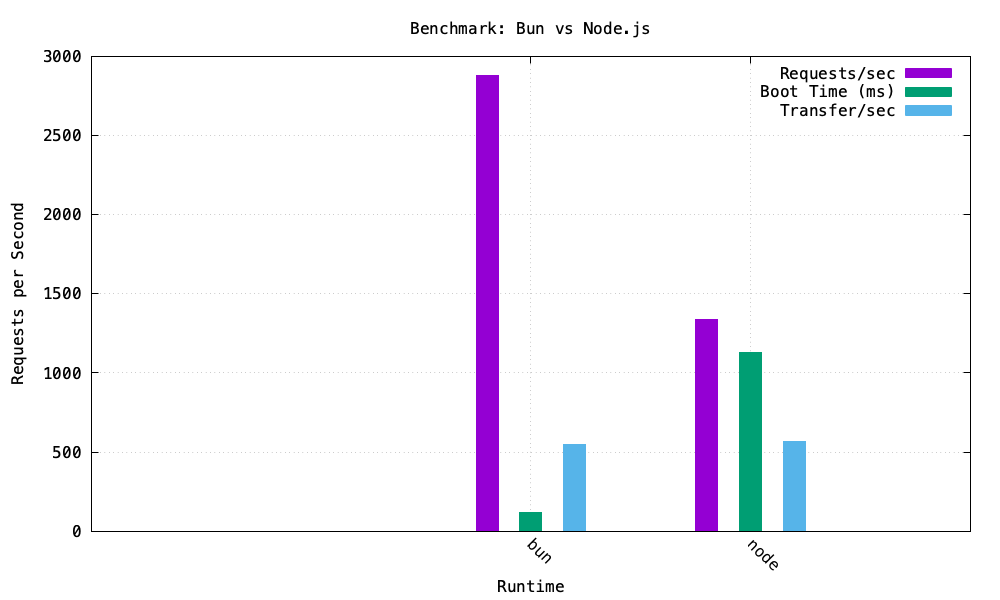

# Bun.js vs Node.js Benchmark

This project benchmarks **Bun.js** and **Node.js** on the following metrics:

- Server boot time
- Requests per second (`wrk` load testing)
- Transfer rate during load

It generates reports in **CSV**, **Markdown**, and **Text** format, and also creates a **PNG graph** using `gnuplot` for visualization.

## 🚀 Results



## 🚀 Prerequisites

Before running the benchmark, you need the following installed on your system:

1. **Bun.js** (for the Bun benchmark)

   - Install Bun: [https://bun.sh](https://bun.sh)
   - Install via `brew`: `brew install bun`

2. **Node.js** (for the Node.js benchmark)

   - Install Node.js: [https://nodejs.org](https://nodejs.org)
   - Install via `brew`: `brew install node`

3. **wrk** (for load testing)

   - Install via `brew`: `brew install wrk`
   - Alternatively, you can follow [wrk's installation guide](https://github.com/wg/wrk#installation).

4. **gnuplot** (for generating the graph)

   - Install via `brew`: `brew install gnuplot`
   - Alternatively, on Ubuntu, you can run: `sudo apt install gnuplot`.

5. **zsh** (optional, but recommended for running the `benchmark.sh` script)

---

## 🛠️ Setup Instructions

### 1. Clone the Repository

First, clone the repository to your local machine:

```bash
git clone https://github.com/yourusername/bun-vs-node-benchmark.git
cd bun-vs-node-benchmark
```

### 2. Install Dependencies

#### For **Bun.js**:

```bash
cd bun-app
bun install
cd ..
```

#### For **Node.js**:

```bash
cd node-app
npm install
cd ..
```

---

## 🏃‍♀️ Running the Benchmark

1. **Start the benchmark script:**

   The main benchmark script is `benchmark.sh`. It runs the server boot time test, load test (`wrk`), and generates reports.

   Make sure all dependencies are installed and then run:

   ```bash
   ./benchmark.sh
   ```

2. **What Happens During Execution:**

   - The script installs necessary dependencies using `bun` and `npm`.
   - It starts both Bun.js and Node.js servers.
   - Measures **boot time** for both servers.
   - Performs a **load test** on the `/users` endpoint with `wrk` using 100 concurrent connections for 10 seconds.
   - Collects results and stores them in:
     - `boot-report.md` (Markdown)
     - `wrk-bun-report.txt` (Bun server load test results)
     - `wrk-node-report.txt` (Node.js server load test results)
     - `benchmark-results.csv` (CSV format for spreadsheet analysis)

3. **After Running the Script**:

   You will see:

   - **Benchmark Results in Markdown** (`boot-report.md`)
   - **Load Testing Results in Text** (`wrk-bun-report.txt`, `wrk-node-report.txt`)
   - **CSV Report** (`benchmark-results.csv`) — use this for further analysis in spreadsheet tools like Google Sheets, Excel, etc.
   - **PNG Graph** (`benchmark-results.png`) showing the load test results as a bar graph (requests per second).

---

## 📈 Visualizing Results

1. To generate a graph from the CSV report, you can run:

   ```bash
   gnuplot graph.gnuplot
   ```

   This will generate a PNG file (`benchmark-results.png`) that visualizes the requests per second (`wrk`) for both Bun and Node.js.

2. View the generated graph:

   - Open `benchmark-results.png` to compare **Bun.js** vs **Node.js** performance visually.

---

## 📑 Report Details

- **`boot-report.md`**: Contains server boot time comparisons (Bun vs Node).
- **`wrk-bun-report.txt` and `wrk-node-report.txt`**: Contain the `wrk` test results including requests per second and transfer rate.
- **`benchmark-results.csv`**: CSV file with:
  - Server (Bun/Node)
  - Boot Time (ms)
  - Requests/sec
  - Transfer/sec
  - Duration
  - Connections
- **`benchmark-results.png`**: Bar chart showing requests per second comparison.

---

## 🧹 Clean Up

To stop any running processes that were started during the benchmark (if needed):

```bash
pkill -f 'bun run' || true
pkill -f 'ts-node' || true
```

---

## ⚠️ Notes

- Make sure both **Bun.js** and **Node.js** are compatible with your environment (check your OS version, dependencies, etc.).
- The benchmark uses `wrk` for load testing the `/users` endpoint. You can modify this endpoint or the test configuration to suit your use case.
- If you encounter any issues with the **Bun.js** startup, ensure that `bun` is properly installed and accessible in your `PATH`.

---

## 🚧 Troubleshooting

### Error: "Unknown file extension `.ts`"

If you see this error, make sure you're using the correct version of `ts-node` (for Node.js) and have the required dependencies in place. You can solve this by updating your `tsconfig.json` and using `ts-node/esm`.

### `wrk` fails to connect

Ensure that both servers (Bun and Node) are running and that they are listening on the correct ports (3001 for Bun, 3002 for Node).

---

## 👥 Contributing

If you have improvements or suggestions for this benchmark tool, feel free to fork the repository, make changes, and submit a pull request.

---

## 📜 License

This project is licensed under the MIT License — see the [LICENSE](https://choosealicense.com/licenses/mit) file for details.
